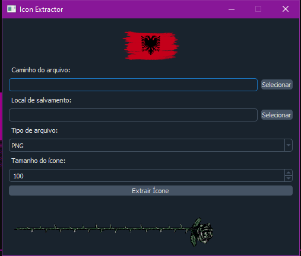

---
# Icon Extractor 🖼️



> Icon Extractor is a Python application designed to extract icons from various file types. It supports both Windows and Linux platforms and provides a user-friendly interface.

## Requirements
- Python 3.x

---
## Usage🎇
1. Run the `start.py` script.
2. The application will automatically check for dependencies, download them if necessary, and then launch.
3. Once launched, the interface allows you to:
    - Select a file.
    - Choose the output format for the extracted icon.
    - Specify the size of the icon.
    - Select the destination folder for saving the extracted icon.
    - Click the "Extract Icon" button to extract the icon.
4. The extracted icon will be saved with the specified format and size in the chosen destination folder.

---

## Features 🎪
- Supports extraction of icons from various file types.
- Saves icons in multiple formats.
- User-friendly interface with animated elements.
- Cross-platform support (Windows and Linux).
- Automated dependency installation and verification.

---
## How to Run
### Linux 🐧
1. Ensure Python 3.x is installed on your system.
2. Open a terminal.
3. Clone the repository using Git:

   ```bash
   git clone https://github.com/your-username/your-repo.git
   ```

4. Navigate to the directory:
   
   ```bash
   cd LiCo-Extrator
   ```

5. Run the following command:
   
   ```bash
   python3 start.py
   ```

---

### Windows 💻
1. Ensure Python 3.x is installed on your system.
2. Download the repository ZIP file from GitHub.
3. Extract the downloaded ZIP file to your desired location.
4. Open a command prompt.
5. Navigate to the extracted directory:
   
   ```bash
   cd path\to\LiCo-Extrator
   ```

6. Run the following command:
   
   ```bash
   python start.py
   ```


---

## Contact 👋
- Discord: lalaio1
- GitHub: lalaio1
